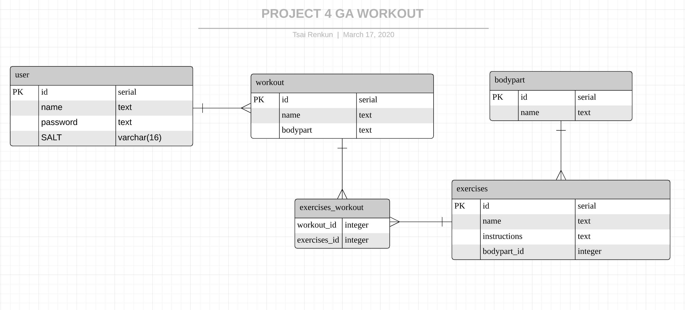

# Workout Keeper
	A One-page application using React to help keep track and to bulid a habit of working out.

## Technologies 
	Javascript
	Html
	Css
	Node.js
	Express
	React
	AJAX
	Bootstrap
	Postgres

## Approach
		Plan,Trial,Incorporate
		Planning stage took about 2 days. Coming up with an idea, wire framing, and creating Tables for the data.
		Data management was the most difficult part of this project. As you will need to see what is necessary and what wasn't.

		Trial 
		Taking data and functions testing them within the local host to ensure it works well with each other. Keeping track which controller is talking to which model. This is an extremely important part for me during my project.

		Incorporate
		When i completed each trial or milestone i had to merge with things that are already in my code. This took a long while as there will be bugs alone the way

## Unsolved Problems
		There are some parts in my app that i still wish to change and improve on.
		1. To input more data into my Database to allow better insight on workouts.
		2. To make the page look more professional.

## ERD

## Problem Statement
	The problem was that planning a workout every week is abit tiring. So i wanted to develop an app to create workouts for people.

## License
MIT License. Free use and change.
